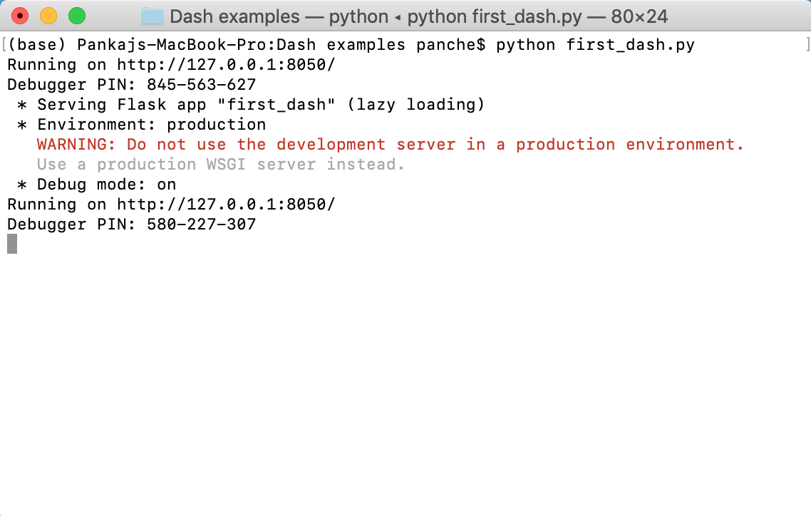
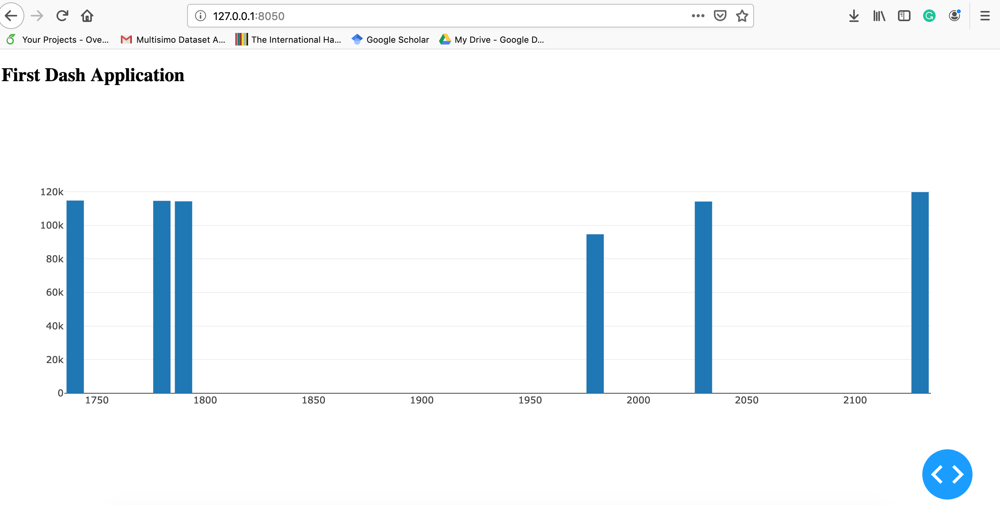

Dashboards play a crucial role in conveying useful and actionable information from collected data regardless of context. As with economically feasible sensors, improved computation, storage facility, and IoT framework, it has become easier to collect an enormous amount of data from a variety of contexts (e.g. military, health-care, education). However, finding insights from collected data remains a challenge. This post offers an introduction to Python Dash a framework that is a great option for dashboard development. I personally really like this framework. It allows me to process my data along with its visualization through a web-based application.

## Dash Framework

`dash` uses [plotly](https://plot.ly) graphics library</a> for plotting graphs. In addition to their graphic feature, these graphs also have a lot of good features (e.g. automatic scaling of axis for timestamp data, etc). Please refer [dash documentation](https://dash.plot.ly/?_ga=2.41664546.1609513145.1566397998-430691971.1566070872) for details.

### Installation

```bash
pip install dash-html-components==0.14.0  # HTML components
pip install dash-core-components==0.44.0  # dash core components
pip install dash-table==3.6.0  # Interactive DataTable component (new!)
```

### First dash application

Now, we are going to develop our first <code>dash</code> application. For this application, we are going to plot the following data (some records are taken from [here](https://github.com/ywchiu/riii/blob/master/data/house-prices.csv). This data has two attributes (House price and area).

A <code>dash</code> application can have number of components (e.g. div block, table, headings, graph). In our application, we are going to use two components - heading and a graph. Let's begin developing it. First of all, we need to import the required packages

```python
import dash_core_components as dcc
import dash_html_components as html
```

The first package is used to create an object of dash application. Second package <code>dash_core_components</code> provides graph components and the third package allows us to include html components (heading, input box) in our application.

Next, we need to create a dash application.

```python
app = dash.Dash(__name__)
```

<code>__name__</code> is a special variable in python which contains name of current module. For instance, when you run your python program using command prompt then it contains <code>__main__</code>.

Now, we will create components to embed in our application. Just to have a clear idea, we want to create following structured with our application.

<pre class=""wp-block-preformatted""><div>

<h2> First Dash Application </h2>

<graph> graph here.. </graph>

</div></pre>

For components, we will use <code>dash_html_components</code> and for graph, we will use <code>dash_core_components</code>.

```python
list_of_data = [{
    'y':[114300,114200,114800,94700,119800,114600],
    'x':[1790,2030,1740,1980,2130,1780],
    'type':'bar'
}]

body = html.Div([
    html.H2(""First Dash Application""),
    dcc.Graph(id='first',
        figure={'data':list_of_data})
])
```

In the above code, we created the body of our application which is a <code>div</code> block. In this block, we created one <code>H2</code> heading component and one <code>Graph</code> component. <code>Graph</code> has a attribute <code>figure</code> where we have specified the data to be plotted. The data (<code>list_of_data</code>) is actually a list of dictionaries (<em>It might seems a bit confusing but you will be good after writing some codes</em>). One important thing-> we used 'type':'bar' which specify that we want to plot <code>Bar</code> chart.

Next, we will set the layout of the application.

```python
app.layout = html.Div([body])
```

Finally, we will start the server

```python
if __name__ == ""__main__"":
    app.run_server(debug=True)
```

You can download this script from [here](https://github.com/pankajchejara23/LearnAITech/blob/master/6%20Python%20Dash/first_dash.py).

Now, we will execute our application. The execution of our application will start a server on the port <code>8050</code>



In order to see the output of the program, open your browser and type <code>http://127.0.0.1:8050</code> in the address bar. It will show you the following screen



Check for more components: [dash_core_components](https://dash.plot.ly/dash-core-components), [dash_html_components](https://dash.plot.ly/dash-html-components).

### Adding CSS style to the app

The next step towards generating a beautiful dashboard is to add a styling feature. We can use [css](https://www.w3schools.com/css/)  stylesheet in our application. It can be specified at the time of creating an application.

```python
app = dash.app = dash.Dash(__name__,external_stylesheets=style)
```

With the above method, you can only add css which are available online. In case if you want to add your local <code>css</code> file, follow the given steps

* Create a folder with name <code>asset</code> in the same directory where your dash script is stored.

* Copy your stylesheet in the asset folder.

* Add the path in your program

```python
dash.Dash(__name__,external_stylesheets=[""\asset\css-file-name""])
```

### Installing Bootstrap component for dash

<code>dash</code> also supports [Bootstrap](https://getbootstrap.com/docs/4.3/getting-started/introduction/) which is a widely used <code>css</code> library. It  can be added in your dash application using  <code>dash-bootstrap-component</code> package ([complete documentation](https://dash-bootstrap-components.opensource.faculty.ai/l/components)). This package allows an easy integration of Bootstrap in the dash application.

You can install it using the following command.

```bash
pip install dash-bootstrap-components
```

Now, let's use it to add a CSS to our first example. We are going to create the following layout for our application. We will utilize Bootstrap's grid system for structuring our components.


First, we need to import <code>dash_bootstrap_components</code> in our previous example.

Next, we will add bootstrap css to your program and then we will create our layout. 

```python
import dash-bootstrap-components as dbc
app = dash.Dash(__name__,external_stylesheets=[dbc.themes.BOOTSTRAP])

# column1 content
column_1 = [
    html.H2(""House Prices""),
    html.P(""This is a demo application which shows house prices with house area.""
    ),
    dbc.Button(""Details"", color=""secondary""),
]

# column content
column_2 = [
    html.H2(""Graph""),
    dcc.Graph(id='first',
        figure={'data':list_of_data}),
]

# Creating layout
body = dbc.Container(
    [   html.H1('With Bootstrap'),
        html.Hr(),
        dbc.Row(
            [
                dbc.Col(column_1,md=4),
                dbc.Col(column_2,md=8),
            ]
        )
    ]
)

# Adding CSS
# dash-bootstrap-components has CDN for bootstrap css in dbc.themes.BOOTSTRAP
app = dash.Dash(__name__,external_stylesheets=[dbc.themes.BOOTSTRAP])
```

You can chek the above source code [here](https://github.com/pankajchejara23/LearnAITech/blob/master/6%20Python%20Dash/with_css.py).
