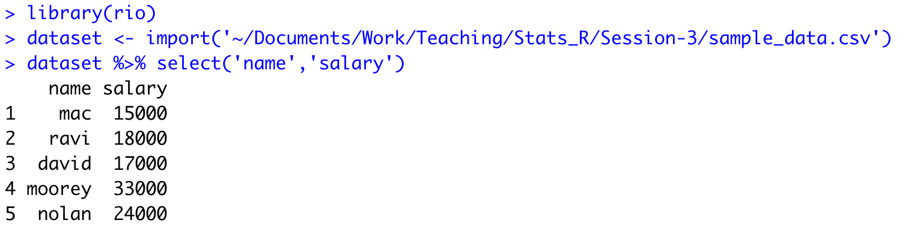
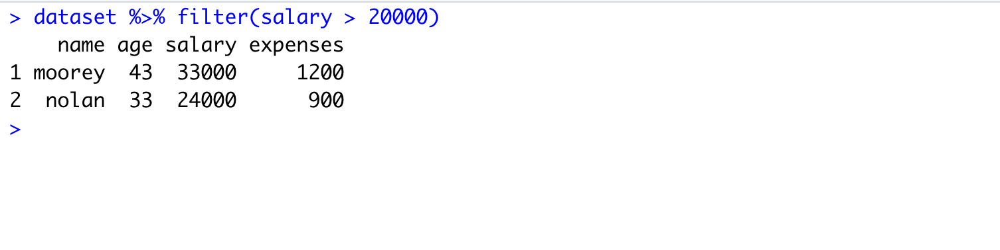
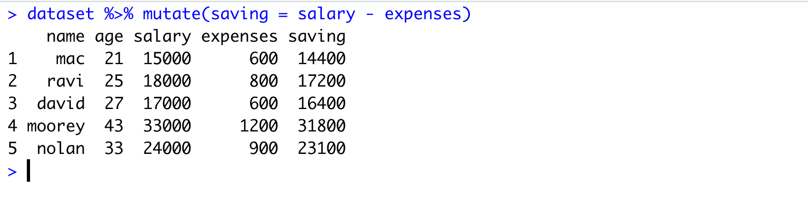
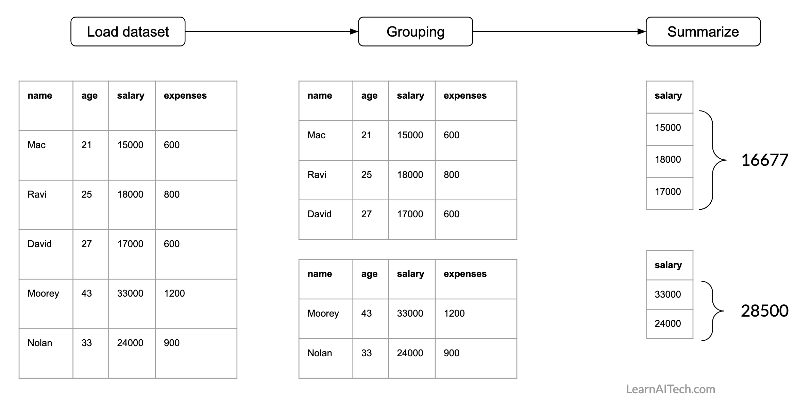
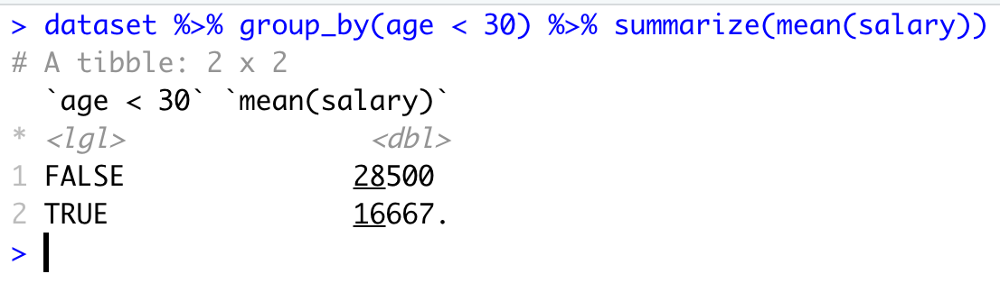
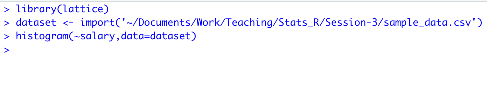
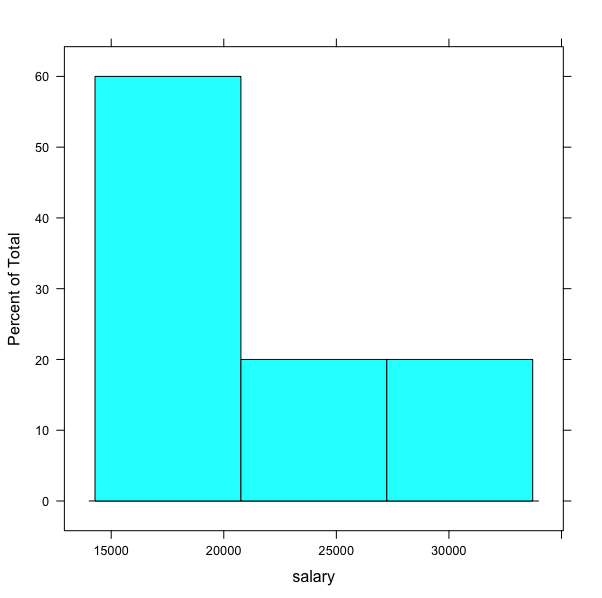
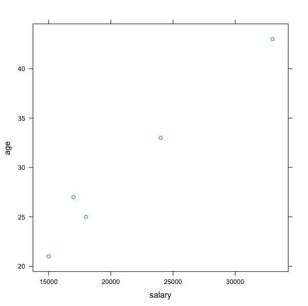
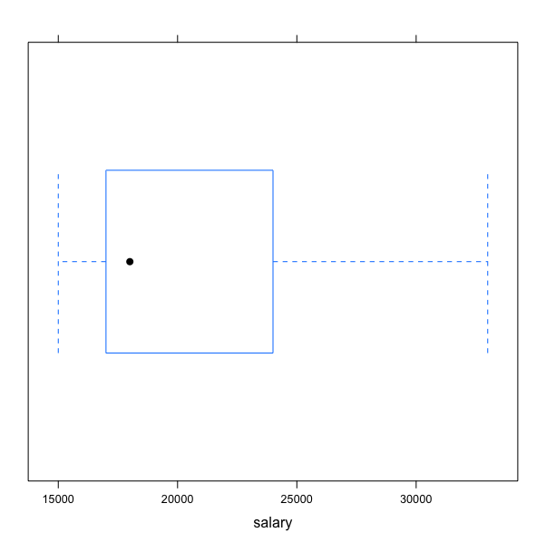

# R tutorial on accessing, filtering, aggregating and plotting data

This post offers a tutorial on how to access, filter, aggregate and plot the data in R. It will mainly covers following topics

1. How to access a particular column or row from a dataframe?
2. How to access rows with conditions?
3. How to generate group wise statistics (e.g., salary statistics for male and female groups)?
4. How to create new column in a dataframe?
5. How to plot distribution of data?
6. How to plot group-wise stats?


###  Pre-requisite

This tutorial requires you to have R-Studio installed on your system. In case if you don't have R-Studio on your system, you can access it online by going to [rstudio-cloud](https://rstudio.cloud).

##### Installing required packages

Go to your R-Studio and execute following command

```R
install.packages('rio')
install.packages('dplyr')
install.packages('lattice')
```

The above commands will install three pacakages (rio)[https://cran.r-project.org/web/packages/rio/vignettes/rio.html],  (dplyr)[https://www.rdocumentation.org/packages/dplyr/versions/0.7.8],  and (ggplot2)[https://ggplot2.tidyverse.org/]. We will use these packages in our tutorials.

### Load a dataset into R-studio

In our first tutorial, we will learn how to load dataset into R-studio. For this tutorial, we will use a very simple dataset available [here](https://github.com/pankajchejara23/Stats-in-R/blob/master/Session-3/sample_data.csv). This dataset contains four attributes (name, age, salary, expenses) (given below).

| name   | age  | salary | expenses |
| ------ | ---- | ------ | -------- |
| mac    | 21   | 15000  | 600      |
| ravi   | 25   | 18000  | 800      |
| david  | 27   | 17000  | 600      |
| moorey | 43   | 33000  | 1200     |
| nolan  | 33   | 24000  | 900      |

We can either use R-studio GUI or we can write code to load the dataset. So let's say you have downloaded the dataset and saved it. You can write following codes to load the dataset into R.

```R
# load the package
library(rio)

# open dataset file
# Specify your dataset filename with complete path
data <– import('filename')
```

Following is the demonstration of both ways for loading the dataset.

<iframe width="560" height="450" src="https://www.youtube.com/embed/_V1CtYJ0NWI" frameborder="0" allow="accelerometer; autoplay; clipboard-write; encrypted-media; gyroscope; picture-in-picture" allowfullscreen></iframe>


### Access particular columns or rows from dataset

So we have loaded the dataset into R and now we want to access two attributes `name` and `salary` using dplyr package.

We will use following syntax

```R
select(data_object,attr_name,attr_name,..)
OR
data_object %>% select(attr_name,attr_name,..)
```

Here, data_object is the object name you have used to load your dataset. You then specify the attributes name which you want to access. 

In our case, we want to access name and salary. Therefore, we will specify these attributes in select().

```R
library(dplyr)
library(rio)
# load dataset
dataset <- import('sample_data.csv')

# access name and salary attributes
dataset %>% select(name,salary)
```


Following is our code from R-Studio.




Similarly you can specify other attributes name which you want to access from your data. You can refer [this](https://dplyr.tidyverse.org/reference/select.html) link to get more information on usage of `select()`.


Now, we will look at rows selection. Let's say we want to fetch data of peple whose salary is higher than 20000.

We will use following syntax

```R
filter(data_object,condition)
OR
data_object %>% filter(condition)
```

To fetch our data, we will use the condition `salary > 20000`. The snapshow below shows the result.



You can refer [here](https://dplyr.tidyverse.org/reference/filter.html) for more information on `filter()` function. Following are some other examples

* Accessing the last row

  ```R
  slice_tail(data_object)
  ```

* Accessing the first row

  ```
  slice_head(data_object)
  ```

* Accessing row with minimum value of an attribute (e.g., who has the minimum salary)

  ```R
  slice_min(data_object, attr_name)
  ```

* Accessing row with maximum value of an attribute (e.g., who has the maximum salary)

  ```R
  slice_max(data_object, attr_name)
  ```


### How to create new attributes using attribute from dataset?

We will take an example to understand this scenario. Let's say we want to calculate the saving for each of the employee (from our salary dataset). So we want to have another attribute (saving) which will simply contains the amount of salary left after subtracting the expenses.

We will use `mutate()` function for this task. Following is the syntax

```R
data_object %>% mutate(expr)
OR
mutate(data_object,expr)
```

Here expr means the expression that will be used to generate new attribute. In our case, the saving can be compute by subtracting expenses from salary. Therefore, expr is `saving = salary - expenses`.



Refer [here](https://dplyr.tidyverse.org/reference/mutate.html) for more detailed information on `mutate()` function.


### How to generate group-wise statistics?

Whiile analyzing the dataset, we are often interested in group-wise statistics. For example, what is average salary for younger and older people or what is difference in sleeping hours in male and female.

To answer these question, we need to way to first group the dataset and then compute required  statistics. 

For our dataset, we can have this question: what is average salary of people who are younger and older than 30 years. So this we will use `group_by()` and `summarise()` functions from dplyr package.

Following is the representation of how the processing needs to be done.


In R, following is the syntax

```R
data_object %>% group_by(attribute_name_used_for_grouping or condition) %>% summarize(statistics_you_need)
```

here first we need to specify attribute which will be used for grouping and then we will specify what summary stats we need. Following are the options for summary stats

* mean(), median()
* sd(), IQR()
* min(), max()
* n()

For more details refer [this](https://dplyr.tidyverse.org/reference/summarise.html)

Now, let's findout average salary of people who are younger and older than 30 years. So, here we need a condition for grouping. For example, if age < 30 then employee belongs to group-1 otherwise he/she belongs to group-2. Then we need to specify the attribute name for computing average.

Following is the illustration of finding group-wise average.



Now, we will do the same using R. For grouping we will use `group_by()` function. Here we need to specify the condition. Then we will summarise using `summarise()` function. Here we need to specify the statistics (e.g., mean, standard deviation, count) and  the attribute/s name which will be used to compute statistics




## Plotting the data

In this section, we will use `lattice` package from R to produce graphs. We will cover create following graphs

* Bar chart
* Box plot
* Density plot
* Histogram
* Scatter plot

You can use following syntax to create graphs using `lattice` package

```R
graph_type(formula,data=)
```

Here, graph_type is the name of graph which you want to plot. In formula, you need to specify what you want to plot. For example, if you want to plot a salary attribute from our dataset, you can write it as `~salary`. If you want to plot two attributes (e.g., age and salary) then you can either write `age~salary` or `salary~age`.

Following table shows the graph_type for each of aforementioned graph

| graph_type  | What it plots       |
| ----------- | ------------------- |
| barchart    | bar chart           |
| bwplot      | boxplot             |
| Densityplot | kernel density plot |
| histogram   | histogram           |
| xyplot      | scatterplot matrix  |

We will learn more about how to write these formuls in our  examples. 

* Let's plot a histogram for salary attribute from our dataset. For this, we will use `histogram` graph type. We will specify the name of the attribute `~salary`. 

  ```R
  dataset <- import(your_file_name_path)
  histogram(~salary,data=dataset)	
  ```







* Now, we will plot the scatterplot for age and salary. We will use xyplot.

  ```
  # You already have your dataset loaded in object dataset
  xyplot(age~salary,data=dataset)
  ```

  

* Let's plot a boxplot for salary attribute.

  ```R
  bwplot(~salary,data=dataset	)
  ```

  

