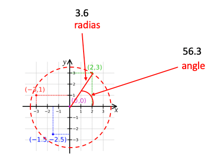
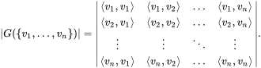
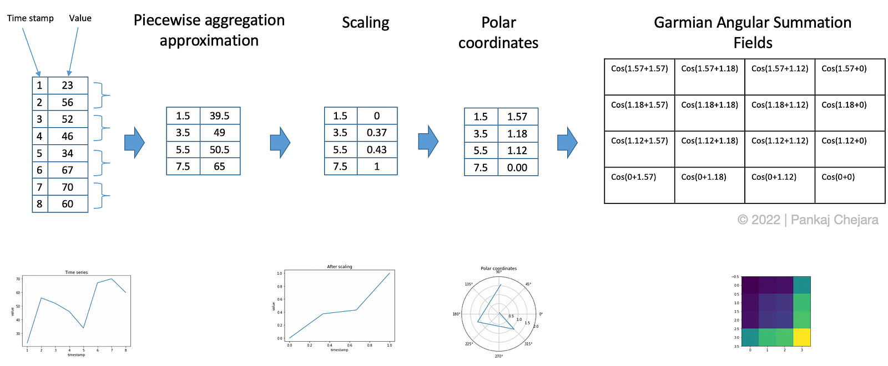
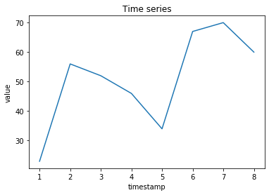
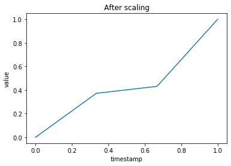
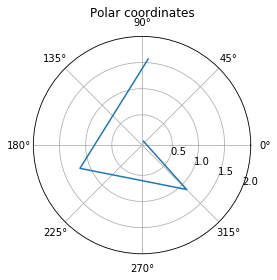

# Understanding Gramian Angular Field to convert your time-series data into an image
In this post, I will share my learning on this topic. I have been searching for a way to use a convolutional neural network (CNN) for my time-series data and this search led me to Gramian Angular Summation/Difference Fields (GASF/GADF).
This post will give you a detailed introduction to Gramian Angular Field and show you 'how to convert time-series data into image' with a help of an example.

## Basic Concepts
Before starting the introduction, I think first we should get our self familiar with the basic concepts of GASF/GADF. If you are already aware then feel free to skip this section.
Cartesian coordinates: You may have most likely seen this in your earlier mathematics classes. In this scheme, the position of a point (or other geometrical shapes) is determined by one or more numbers. For example, if we take two-dimensional coordinate systems then a position is determined with a pair of numbers, e.g., (2,3). The position is then presented with a point on distance from two reference lines, known as the x-axis and y-axis.


### Polar coordinates
 Imagine a circle with origin as center drawn on the image above shown image in a way that it crosses point (2,3). Now, we will take the radius of this circle and the angle between a line connecting (0,0) to (2,3) and X-axis. These two numbers now represent the same position but using a polar coordinate system. Taking the above example, the point will not be represented as (3.6, 56.3)



### Gramian matrix
 Let's say we have a set of vectors V. The Gramian (Gram) matrix is a matrix of inner products of every pair of vectors from V. As you can see in the below image, each element in the matrix <vi,vj> is vector production between vectors vi and vj.




## Gramian Angular Fields
Now we will move towards the main goal of this post that is understanding the process of representing a time-series is represented in an image. In short, you can understand the process in three following steps.


### Converting time series into image using Gramian Angular Summation Field 

* Aggregate the time series by taking the mean of every M points to reduce the size. This step uses Piecewise Aggregation Approximation (PAA).

* Scaling values in the interval [0,1].

* Generating polar coordinates by taking timestamp as radius and inverse cosine (or arccosine) of scaled value. This will give us the value of the angle.
Generate Gramian summation/difference angular fields. In this step, every pair values are summed (subtracted) and then cosine is taken on the summed value.

In case, if you couldn't understand some part of the process no worries, we will see each step in detail below.

### Example in Python
I am providing here an example in python to demonstrate the state by step process of converting a time series into an image using gramian angular field. 

#### Importing packages
```python
from pyts.approximation import PiecewiseAggregateApproximation
from pyts.preprocessing import MinMaxScaler
import numpy as np
import matplotlib.pyplot as plt
```
#### Dummy data
```python
X = [[1,2,3,4,5,6,7,8],[23,56,52,46,34,67,70,60]]
plt.plot(X[0],X[1])
plt.title('Time series')
plt.xlabel('timestamp')
plt.ylabel('value')
plt.show()
```


#### Piecewise aggregation approximation and scaling
```python
# PAA
transformer = PiecewiseAggregateApproximation(window_size=2)
result = transformer.transform(X)

# Scaling in interval [0,1]
scaler = MinMaxScaler()
scaled_X = scaler.transform(result)
plt.plot(scaled_X[0,:],scaled_X[1,:])
plt.title('After scaling')
plt.xlabel('timestamp')
plt.ylabel('value')
plt.show()
```


#### Converting to polar coordinates

```python
arccos_X = np.arccos(scaled_X[1,:])
fig, ax = plt.subplots(subplot_kw={'projection': 'polar'})
ax.plot(result[0,:], arccos_X)
ax.set_rmax(2)
ax.set_rticks([0.5, 1, 1.5, 2]) # Less radial ticks
ax.set_rlabel_position(-22.5) # Move radial labels away from plotted line
ax.grid(True)
ax.set_title("Polar coordinates", va='bottom')
plt.show()
# Gramian angular summation fields
field = [a+b for a in arccos_X for b in arccos_X]
gram = np.cos(field).reshape(-1,4)
plt.imshow(gram)
```


:::{.callout-tip}
## Some additional explanation
The aforementioned steps are for illustrating the process of converting time series into an image using Gramian Angular Summation/Difference Field. In practice, we don't need to compute polar coordinates thanks to trigonometry (following rules).
$$
cos(A+B) = cos(A)cos(B) + sin(A)sin(B)
$$
$$
1 = sin^2(A) + cos^2(B)
$$
For computing Cos(A+B) in Gramian Angular Field computation, we expand it as following

$$
cos(A+B) = cos(A)cos(B) + sin(A)sin(B)
$$
$$
= cos(A)cos(B) + \sqrt(1- cos^2(A)) \sqrt(1- cos^2(B))
$$
$$
= x_a * x_b + \sqrt(1- x_a^2) \sqrt(1- x_b^2)
$$
Because we computed A and B by taking cosine inverse of time series value (actually on values after PAA and scaling).

You can checkout this python library [pyts](https://pyts.readthedocs.io%2Fen%2Fstable%2Findex.html).
:::


## References
* Wang, Z., & Oates, T. (2015). Imaging time-series to improve classification and imputation. IJCAI International Joint Conference on Artificial Intelligence, 2015-January, 3939–3945.
* Eamonn J Keogh and Michael J Paz- zani. Scaling up dynamic time warping for datamining applications. In Proceedings ofthe sixth ACM SIGKDD international conference on Knowledge discovery and data mining, pages 285– 289. ACM, 2000.
* https://pyts.readthedocs.io/en/stable/_modules/pyts/image/gaf.html#GramianAngularField
* https://pyts.readthedocs.io/en/stable/index.html
