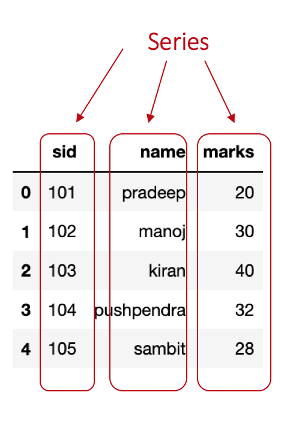
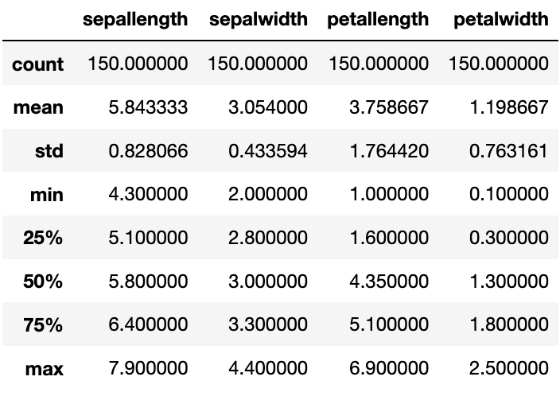
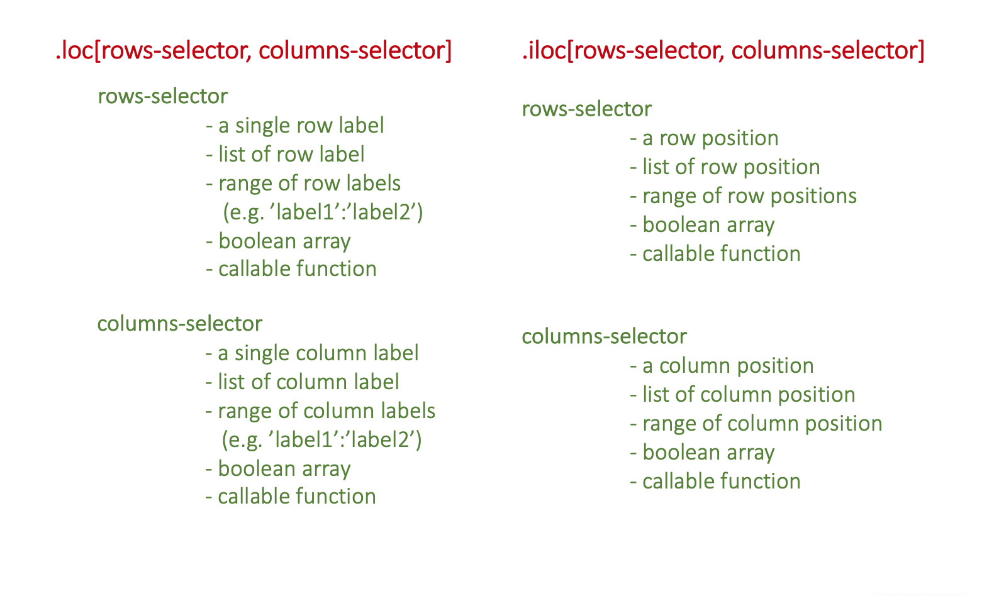
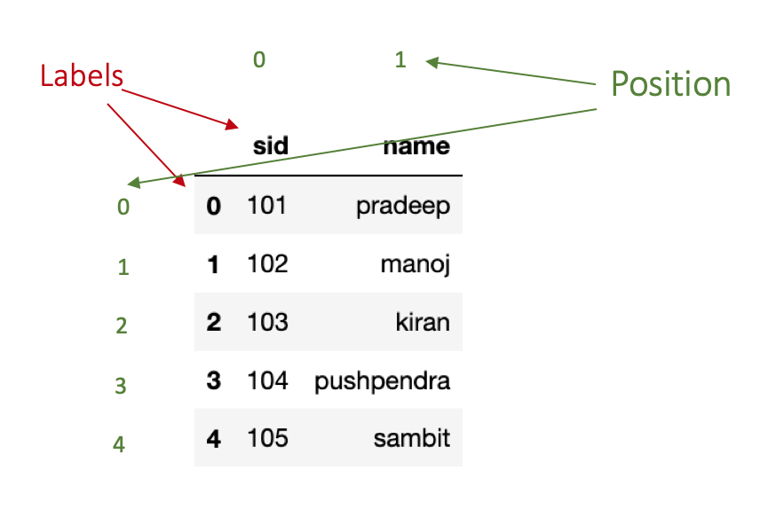
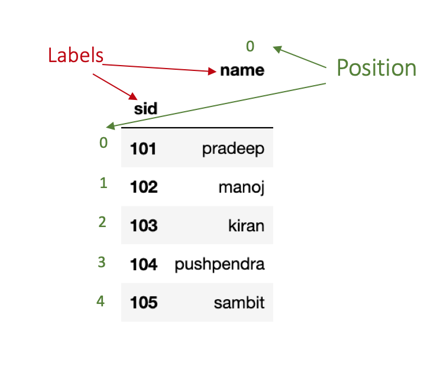
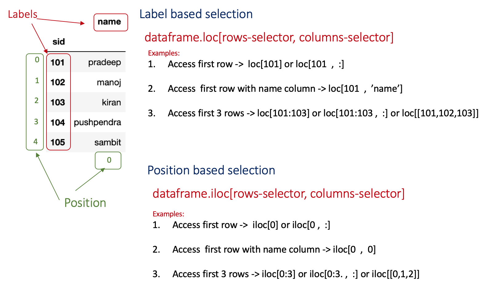
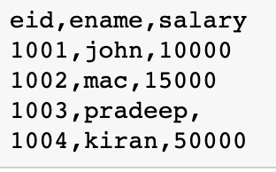
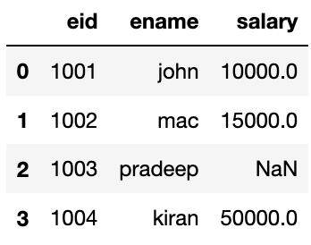
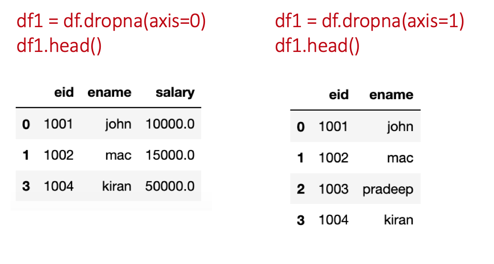
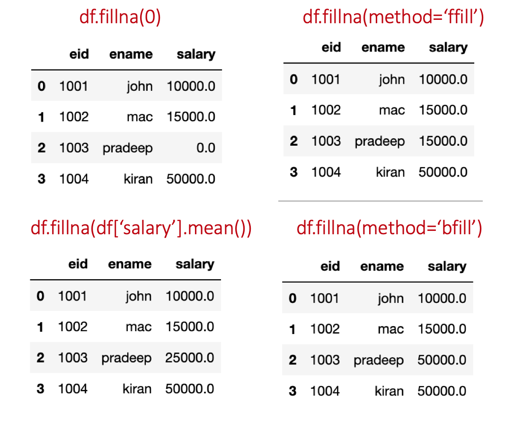

Pandas is a Python API for processing data in a easy and efficient way. This post offers an introduction to this amazing API , especially for beginners. 

The post starts with installation instructions of the API and then introduces its functionality with the help of examples.

## Installation

<!-- wp:paragraph -->
<p>There are two options to install the Pandas API on your system. The first option is to install it through [Anaconda Distribution](https://www.anaconda.com/) which comes with all essential Python packages. While the second option is to install Python on the system and then install Pandas package using the following command.
<!-- /wp:paragraph -->

<!-- wp:code -->
```bash
pip install pandas
```

## Introduction

Now we will explore the API basics. Basically, we will cover the following topics which I think will be good enough to start using Pandas API.</p>
<!-- /wp:paragraph -->

<!-- wp:list -->
<ul><li>Pandas DataFrame and Series objects</li><li>Reading data CSV files and accessing basic information</li><li>Querying data using loc() and iloc() function</li><li>Handling missing data</li><li>Adding, deleting columns or rows</li></ul>
<!-- /wp:list -->

<!-- wp:heading {""level"":3} -->
### Pandas DataFrame and Series objects
Pandas' Series is a one-dimensional array representation of values. we can understand it as an attribute in a dataset. For instance, consider a dataset with three attributes sid (student-id), name, and marks. Now, each of these attributes in pandas is represented as a Series object.



<p>Let's write a program to create these three Series objects sid, name, and marks.</p>

```python
import pandas as pd

# Creating Series using list
id = pd.Series([101,102,103,104,105])

name = pd.Series(['pradeep','manoj','kiran','pushpendra','sambit']

marks = pd.Series([20,30,40,32,28])</code></pre>
```

The first line <code>import pandas as pd</code> imports the pandas package in wer program. Next, three lines create three Series objects with a given list.

<p>Pandas' DataFrame object is a two-dimensional data structure where each attribute is a Series object. we can create a DataFrame using a dictionary of key:value pair where the key represents attribute name and the value represents the values of that attribute. 

Let's create a dataframe using the Series objects we created in the above program.</p>

```python
df = pd.DataFrame({'sid':id,'name':name,'marks':marks})
```


### Reading data CSV files and accessing basic information
Pandas have a function  <code>read__csv()</code> to read CSV format data files. This function comes with multiple useful options which we will learn in this section. The data file used in this tutorial can be downloaded from the [link](https://datahub.io/machine-learning/iris/r/iris.csv). The name of the downloaded data file is `iris_csv.csv`. <br/>


#### Open and read a CSV data file

```python
import pandas as pd
df=pd.read_csv('iris_csv.csv')
df.head()
```


<p><code>df=pd.read_csv('iris_csv.csv')</code> opens and reads the specified CSV file (here we can specify the name of wer data file). The third line <code>df.head()</code> shows first five records (we can specify the number of records) from wer data file.</p>

#### Assign/Rename column names

<p>In case, if wer data file does not have column names or we want to assign a different column name then we can use the <code>names</code> option of <code>read_csv()</code> function.<br>
Example:</p>

```python
import pandas as pd
df = pd.read_csv('iris_csv.csv',names=['sep-len','sep-wid','pet-len','pet-wid','class'])
```

#### Reading data file with different seperator

<p>Sometimes the data files have columns seperated by other characters (e.g. spaces, colon). In such cases, in order to read the CSV file we need to specify the <code>sep</code> option in the read_csv() function.</p>

```python
# reading file having data seperated by :
df = pd.read_csv('data_file',sep=':')
```

#### Skipping rows while reading data

<p>In case, if wer data file does not have data records from the first line (let's say it contains some summary or description and data records begins from line 4), we can skip those lines by specifying <code>skip rows</code> option.</p>

```python
df = pd.read_csv('data_file',skiprows=3)
```
#### Accessing sizes of data

we can check the size of wer data set (e.g. number of rows, number of columns) using <code>shape</code> property of the DataFrame.

```python
import pandas as pd
df = pd.read_csv('iris_csv.csv')
print(df.shape)
# output
# (150, 5)
```
<p>Here, 150 is the number of rows and 5 is number of columns.</p>

#### Checking data types of columns

<p>To check the data types of columns in the data file, we can use <a href=""https://pandas.pydata.org/pandas-docs/stable/reference/api/pandas.DataFrame.dtypes.html"">dtypes</a> property.</p>
<!-- /wp:paragraph -->

<!-- wp:code -->
```python
import pandas as pd
df = pd.read_csv('iris_csv.csv')
df.dtypes</code></pre>
```
<p>Output:</p>

<pre class=""wp-block-code""><code>sep-len    float64
sep-wid    float64
pet-len    float64
pet-wid    float64
class       object
dtype: object</code></pre>
<!-- /wp:code -->

::: {.callout-tip}
As the data processing modules requires wer data to be in numeric data types (e.g. int, float) it is best practice to check the data types before processing it.
:::

#### Basic stats of data

If we want to learn about our data in more depth, we can use <code>describe()</code> function. This function provides information about count, minimum, maximum, mean, standard deviation, quartiles for each column. 
An example is given below.

```python
import pandas as pd
df = pd.read_csv('iris_csv.csv',skiprows=1,names=['sep-len','sep-wid','pet-len','pet-wid','class'])
df.describe()</code></pre>
```




### Querying data using loc() and iloc() function
Pandas offers two different functions (there is one more <code>ix()</code> which is actually deprecated) for accessing data from the dataframe- <code>.loc()</code> and <code>.iloc()</code>. In these functions, we specify the labels or positions of rows and columns to access data. However, if we <strong>do not specify columns selector then by default all columns are accessed</strong>.




::: {.callout-tip} 
`:` operator used for slicing purpose. It works differently in case of label and position. When applied with labels (start:end), it include <code>end</code> element in the result. However, in case of positions (start:end), it does not include <code>end</code> in the result.
:::


<p>Let's understand the difference between labels and positions. In the following code, we are creating a simple dataframe with two columns <code>sid</code> and <code>name</code>.</p>


```python
import pandas as pd
df = pd.DataFrame({'sid':[101,102,103,104,105],'name':['pradeep','manoj','kiran','pushpendra','sambit']})
df.head()
```
As shown in the figure below, the row labels are (0,1,2,3,4) and column labels are (sid, name).<br> The position for rows and columns begins with 0 that means the first row has position 0, second row has position 1 and so on.


In the above example, the rows position and labels are same. To make the difference clear, let's try to change the index of our dataframe and then see it.<br>
we can change the index of dataframe using <code>set_index()</code> function. In the following example, we are setting the first column <code>sid</code> as the index of our dataset. This function create a copy of dataframe, apply changes it it and then return the updated copy. In order to make changes to dataframe <code>inplace=True</code> parameter needs to be passed.

```python
df.set_index('sid',inplace=True)
df.head()
```

<p>As we can see in the figure below, rows' indices are (101,102,103,104,105) whereas rows' positions are the same as previous.</p>



#### Some Examples
The following figure shows some examples for accessing data with label and position-based selections.


<p>To access a particular row, we need to specify its label or position in the row-selector (for example, we have to specify label 0 to access first row). In case, if we want to access multiple rows, we need to specify their corresponding labels or positions in a list or we can use <code>:</code> operator for slicing (for example, row selector for accessing first three rows can be [0,1,2] or 0:3).</p>

```python
# import pandas package
import pandas as pd

# create the dataframe
df = pd.DataFrame({'sid':[101,102,103,104,105],'name':['pradeep','manoj','kiran','pushpendra','sambit']})

# set sid as index
df.set_index('sid',inplace=True)

# Access first row
df.loc[101]  # lable-based

df.iloc[0]  #  Position-based


# Access first three rows
df.loc[101:103]  # label-based

df.iloc[0:3]  # position-based
```
#### Condition-based data access
<!-- /wp:paragraph -->

<!-- wp:paragraph -->
<p>Function <code>loc()</code> and <code>iloc()</code> both support condition-based data access using boolean array. Let's say we want to access the first row. To do that we need to specify a boolean array for rows selection. This array will contain a boolean value for each row and only one `True` value. 

If we want to show a particular set-of rows, we can do that by specifying a boolean array with True values on corresponding location of those rows. Same applies for column selection.</p>

```python
import pandas as pd
df = pd.DataFrame({'sid':[101,102,103,104,105],'name':['pradeep','manoj','kiran','pushpendra','sambit']})

df.loc[[True,False,False,False,False],[True,True]]

#Output
#      sid     name
#0     101     pradeep
```
<!-- wp:paragraph -->
<p>In the above example, we spcified a boolean array for rows selection and another for columns selection. In the first array, <code>True</code> is specified at the first index (which corresponds to the first row). The second array contains all <code>True</code>(which corresponds to all columns). Hence, we get the values from the first row and both columns.</p>

### Handling missing data

Pandas offers a great support to handle missing values. If the dataset has some values missing, Pandas automatically marks them as <code>NaN</code> values. 
To demonstrate it, I have prepared a CSV file with three columns- eid, name, salary.



In this file, I intentionally kept the salary field for the third record empty for the following exercises on the missing values. 

Now let's read this file using pandas.

```python
df=pd.read_csv('emp.csv')
df.head()
```
<p>Output:</p>



<p>We can handle missing values in two ways: delete or replace. The following sections discusses these both ways.</p>

#### Deleting missing values
<!-- /wp:paragraph -->

<!-- wp:paragraph -->
We can use the <code>dropna()</code> function to delete missing records. 

In this function, we need to specify <code>axis=0</code> if we want to delete the row/rows having NaN and for deleting column/columns having `NaN` specify <code>axis=1</code>.
<!-- /wp:paragraph -->

<!-- wp:code -->
```python
df=pd.read_csv('emp.csv')

#delete row
df1 = df.dropna(axis=0)
df1.head()

#delete column
df1 = df.dropna(axis=1)
df1.head()</code></pre>
```



:::{.callout-tip}
To change the original dataframe, specify <code>inplace=True</code> in the <code>dropna()</code> function.
:::
<!-- wp:paragraph -->
#### Filling missing values
<!-- /wp:paragraph -->

<!-- wp:paragraph -->
<p>Function <code>fillna</code> is useful in filling missing values in the dataframe.</p>

```python
df=pd.read_csv('emp.csv')

#fill with 0
df1 = df.fillna(0)
df1.head()

#fill using forward fill method
df2 = df.fillna(method='ffill')
df2.head()

# fill using backward fill method
df3 = df.fillna(method='bfill')
df3.head()

# fill using mean value of column
df4 = df.fillna(df['salary'].mean())
df4.head()
```



:::{.callout-tip}
<code>ffill</code> replaces `NaN` with the previous value in the same column. While, `bfill` replaces `NaN` with the next value in the same column (order of values top to bottom).
:::

### Add or delete row/column
<p>This section will show we how to add a new row or column to an already existing dataframe.</p>

#### Adding row/column
We can simply add a row using <code>append()</code> or <code>loc()/iloc()</code> function. We can use `key:value` pair in the append function, where the key is the attribute name and the value represents the value we want to add. Pandas automatically puts `NaN` if some attributes values are not provided. 

Now, let's add a record with <code>sid</code> as 106 and <code>name</code> as 'gaurav'.</p>

```python
import pandas as pd
df = pd.DataFrame({'sid':[101,102,103,104,105],'name':['pradeep','manoj','kiran','pushpendra','sambit']})

# using the append function
df = df.append(append({'sid':106,'name':'gaurav'},ignore_index=True)
print(df)

# Adding a column
df['marks'] = [20,30,40,32,28,50]
```
The same record can also be added using  <code>df.loc[5]=[106,'gaurav']</code>.


#### Deleting row/column
<!-- /wp:paragraph -->

<!-- wp:paragraph -->
<p>To delete some columns or rows, the <code>drop</code> function can be used. In this function, we need to specify the label of row or column we want to delete. In case, it is a column then we also need to pass a parameter <code>axis=1</code>. 

The following example illustrates the use of `drop` function.</p>
```python
import pandas as pd
df = pd.DataFrame({'sid':[101,102,103,104,105],'name':['pradeep','manoj','kiran','pushpendra','sambit']})

# delete sid column
df.drop('sid',axis=1)
```